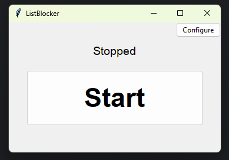
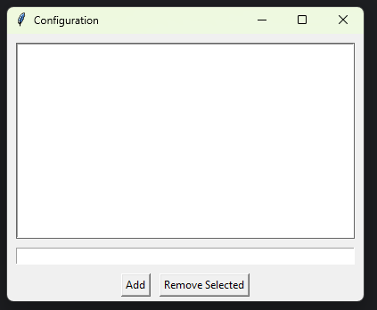

# ListBlocker
ListBlocker is a lightweight .exe utility that automatically minimizes apps through list input. It is useful for productivity, focus, and avoiding distraction.
# Installation
Install the .exe, and run it.
# Features
- Persistent block list (JSON)
- System tray app
- Live monitoring
- Minimizes processes
- Standalone executable
# Screenshots

